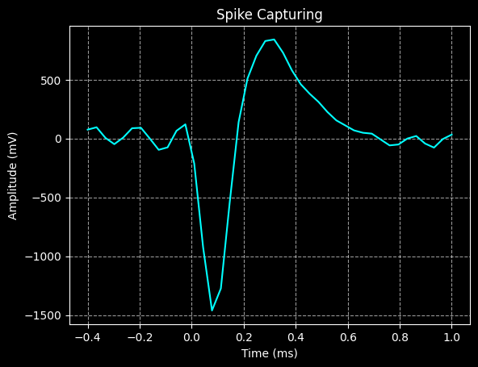
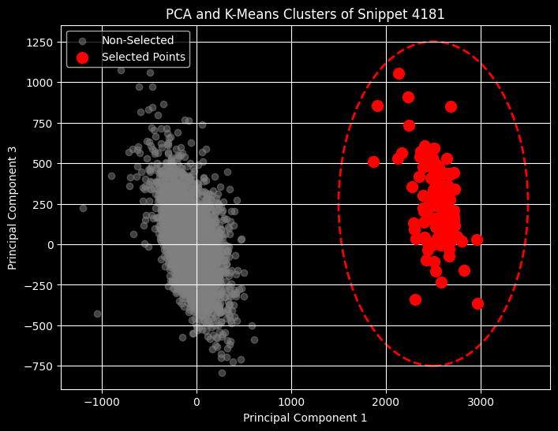

# Spike Detection Classification Project

This repository contains code for a neuroscience project that applys deep learning techniques to spike sorting from Open Ephys data. The project is divided into three main stages:

1.  **Data Preprocessing and Spike Extraction**: Loading raw electrophysiology data, applying filters to remove noise, and detecting neuronal spikes based on a voltage threshold.
2.  **Neural Network Spike Classification**: Using machine learning models (CNN and GRU) to distinguish true neuronal spikes from background noise.
3.  **Neural Network Spike Clustering**: Using dimensionality reduction (PCA, Autoencoder) and clustering algorithms (DBSCAN) to classify neuronal spikes into individual neurons.

## 📈 Results

1. **Data Preprocessing and Spike Extraction** 

The raw neural recordings from a zebra finch were obtained using a Cambridge Neurotech probe (ASSY-236-H5). To isolate neural spikes, the data underwent several preprocessing steps:

- Filtering: The raw signal was band-pass filtered between 300 Hz and 8 kHz to focus on the frequency range of action potentials. A 50 Hz notch filter was applied to eliminate electrical line noise.

- Thresholding: An initial voltage threshold was set at 3 times the standard deviation of the signal. This threshold was then dynamically adjusted to optimize spike detection.

- Refractory Period: To account for the biological refractory period of a neuron, any spikes detected within 1 ms of a previous spike were discarded. An example spike waveform is shown below.



Spike Classification and Clustering

After extraction, the detected spikes were classified into either neuron spikes or background noise. This was accomplished using principal component analysis (PCA) on the waveforms from each channel. The PCA plot showed distinct clusters, with the neuron spikes forming a group visually separate from the background noise. A circle was then manually drawn around the neuron spike cluster to distinguish it.

Spikes from five channels were processed in this manner and saved as .npy files for subsequent training and testing of a neural network for spike sorting.



2. **Neural Network Spike Classification**

Neural Network Spike Sorting
This section details the training and evaluation of two neural network models—a Convolutional Neural Network (CNN) and a Gated Recurrent Unit (GRU)—for the purpose of classifying neural spikes from background noise.

Data and Model Input

- Input Data: The input for both models was a 1D tensor of length 42, representing a single spike waveform.
- Target Labels: Each waveform was labeled as either 0 (background noise) or 1 (neuron spike).
- Dataset Split: The data was split into three sets:
  - Training Set: 3 channels (n_background = 12,962, n_neuron = 2,491)
  - Validation Set: 1 channel (n_background = 6,835, n_neuron = 819)
  - Test Set: 1 channel (n_background = 4,073, n_neuron = 108)

Model Performance

The performance of both the CNN and GRU models was evaluated on the held-out test dataset. The results are summarized below:

Metric | CNN Model | GRU Model
--- | --- | ---
Accuracy | 0.9823 | 0.9735
Macro Precision | 0.7967 | 0.7461
Macro Recall | 0.9909 | 0.9729
Macro F1 Score | 0.8678 | 0.8202
Inference Time on Test Dataset | 411 ms | 1.36 s

The CNN model performed better and has faster inference on the test dataset.

3. **Neural Network Spike Clustering**

This section explores the use of Principal Component Analysis (PCA) and an autoencoder neural network to create low-dimensional embeddings for spike sorting. The goal was to reduce the dimensionality of the spike waveforms to a size of 3, which were then used for clustering. The DBSCAN algorithm was used for clustering in both experiments.

PCA Clustering


Autoencoder Clustering


Both methods successfully isolated the neuron spike cluster from the background noise. However, it's worth noting that the autoencoder's performance here is based on a limited dataset. Future work could explore how autoencoder model compares to PCA in datasets with multiple neuron clusters per channel.

## 📦 Setup and Installation

1.  **Clone the repository:**
    ```
    git clone https://github.com/henryxcham/spike_detection_classification.git
    cd spike_detection_classification
    ```
2.  **Create a virtual environment:**
    ```
    conda create --name spike_detection_classification python=3.12
    conda activate spike_detection_classification
    ```
3.  **Install the required packages:**
    ```
    pip install -r requirements.txt
    ```

## 📈 Usage

The data and models are saved in the repo. The notebooks can regenerate both the data and models.

1. Data Download

 The 01_data_loading_and_spike_extraction.ipynb notebook downloads the raw electrophysiology data and extract the neuron and background spikes. The data in the repo was recreated by extracting the spikes from 5 different channel of the recording.

2. Spike Classification Evaluation

 The 02_spike_classification_evaluation.ipynb notebook trains the CNN and GRU classifiers to detect background versus neuron spikes. The best-performing models are saved to the model directory. Both models are evaluated on a separate test dataset.

3. Spike Clustering Evaluation

 The 03_spike_clustering_evaluation.ipynb notebook trains an autoencoder on the background and neuron spikes. DBSCAN clustering is applied to both the autocoder and PCA embeddings and the results are visualized as distinct spike clusters.

 The models can be trained using python script instead of the notebooks.

 `python scripts/train_autoencoder.py`

 `python scripts/train_cnn.py`

 `python scripts/train_gru.py`

